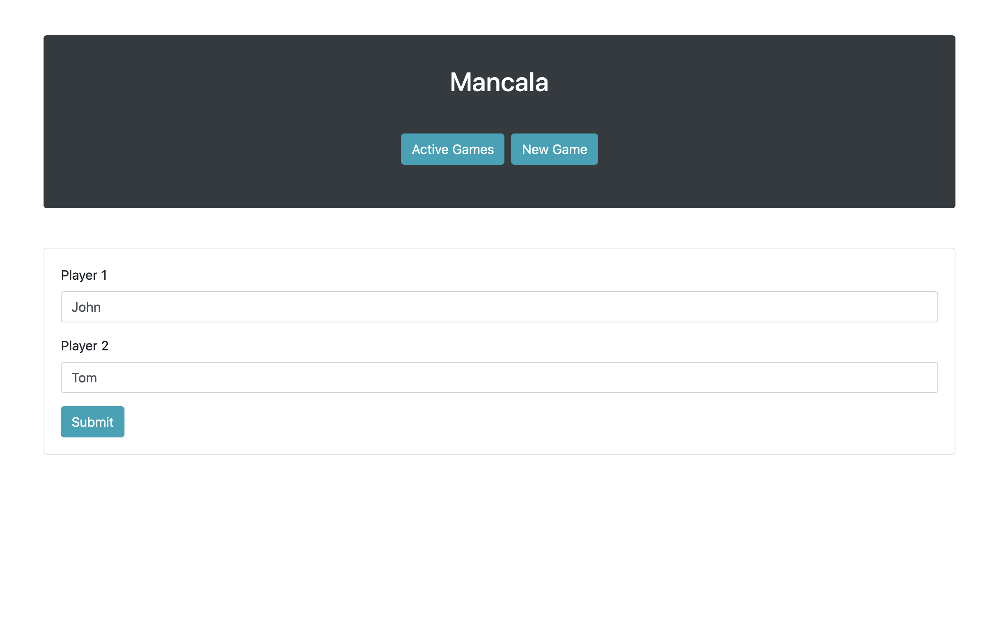
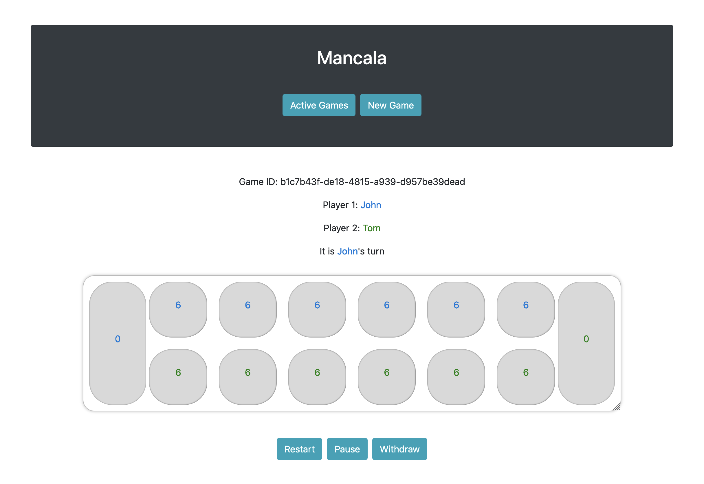
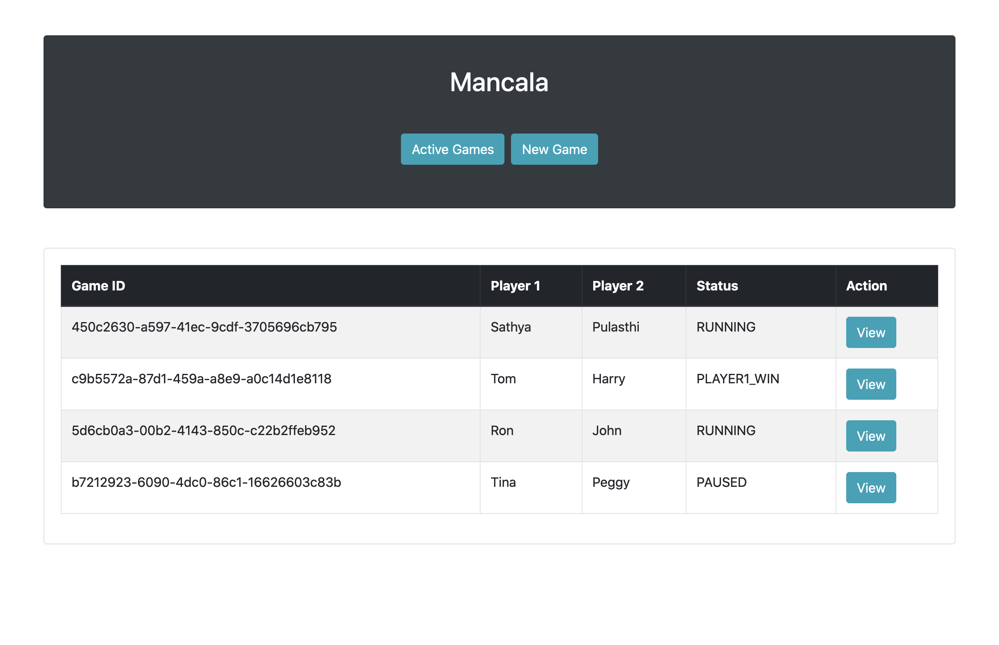

# Mancala Game
This is a web-based implementation of [Mancala Game](https://en.wikipedia.org/wiki/Mancala). It enables two 
human players to play the game, from the same computer. There is no AI implemented.

## Game Rules

### Game Play
The player who begins with the first move picks up all the stones in any of his 
own six pits, and sows the stones on to the right, one in each of the following 
pits, including his own big pit. No stones are put in the opponents' big pit. 
If the player's last stone lands in his own big pit, he gets another turn. 
This can be repeated several times before it's the other player's turn.
### Capturing Stones
During the game the pits are emptied on both sides. Always when the last 
stone lands in an own empty pit, the player captures his own stone and all 
stones in the opposite pit (the other player’s pit) and puts them in his own
big pit.
###  The Game Ends
The game is over as soon as one of the sides runs out of stones. 
The player who still has stones in his pits keeps them and puts them in his
big pit. The winner of the game is the player who has the most stones in his 
big pit.

## Getting Started

Make sure you have the following setup in your environment before getting started.
* JDK 8+
* Maven 3.8.1
* Nodejs 14.17.0
* Angular CLI 12.2.6

### Building
```
mvn clean install
```
 Use the following commands for compiling and building the frontend. This step is optional.
```
cd src/main/mancala-web
npm install
ng build --prod
```
### Running

```
java -jar target/mancala-0.0.1-SNAPSHOT.jar
```

### How to Play?

* After running the project, navigate to http://localhost:8080 in a web browser 
to open the Mancala Web Application.
* Click 'New Game' and enter player 1 and player 2 Names. Now you will be able
to play the game according to the game rules.
* If you click 'Active Games', you will be able to see a list of all the active 
  games.  

### Screen Shots





### API Documentation

API endpoint documentation is available at: <http://localhost:8080/swagger-ui.html>

### Running Tests

```
mvn test
```

## Technology Stack

* [Spring Boot](https://projects.spring.io/spring-boot/) - The framework used for backend
* [Angular](https://angular.io/) - The framework used for frontend
* [Maven](https://maven.apache.org) - Dependency management
* [JUnit](https://junit.org) - Test framework
* [Swagger](https://swagger.io) - Used to generate API docs

## Design Patterns

* Builder 
* Strategy

## Potential Improvements

* Enhanced user interface
* Persistence layer and caching
* Improved error handling and logging  
* Security & Authentication
* Session management
* Player vs Computer (AI)
* Online play
